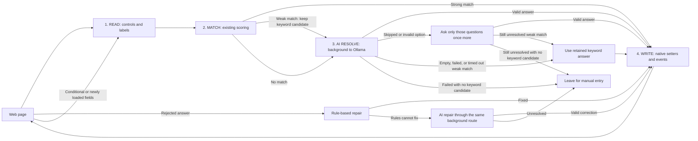

<!-- Time log (9 Oct 2026): created 2:36 PM by Codex (before this session) · last changed 5:52 PM -->
# Autonoma — Hackathon demo setup

Updated: 9 October 2026. Scope: a 24-hour hackathon product demo using React + SCSS and local AI only. This document began as a migration plan for the original Aullevo code. The extension is now built in this workspace; see section 0 for what exists, how to run it, and what was verified.

## 0. Current status and quick start

**Built and verified on this laptop (9 October 2026).** `npm run lint`, `npm run match:check` (14 cases), and `npm run build` pass. A headless Chromium run that loaded `dist/` as an unpacked extension filled the two-step demo form end to end with Pagination: 6 fields by rules, 7 by local AI, the résumé attached by score, the code-of-conduct box left for the user, and a stop before Submit. Measured runs took **7.1 s** for both pages with the model preloaded and **1.1 s** for a single page with Ollama unreachable (keyword fallback only). That test forwarded Ollama calls without the extension's `Origin` header. Step 1 below is what makes the real browser work.

| Piece | Where |
| --- | --- |
| Side panel: AI status and preload, model picker, Fill/Stop, Pagination, Multi-Link, report | `src/ui/Panel.tsx` |
| Workspace (options page): profiles, memory, files, Local AI settings, import/export, demo profile | `src/ui/Workspace.tsx` |
| Fill flow (read → match → AI → write, repair, badges) | `src/content/` |
| Ollama transport, prompt, answer validation | `src/services/aiService.ts` |
| Demo form and server | `demo/index.html`, `npm run demo` → http://127.0.0.1:5500 |

**Run it:**

1. **Allow Chrome extensions to call Ollama (once).** By default Ollama answers extension requests with HTTP 403, and the panel then reports “Ollama blocked this extension”. In PowerShell, run `setx OLLAMA_ORIGINS "chrome-extension://*"`, then quit Ollama from the system tray and start it again. To allow only this extension, use `chrome-extension://<ID>`; the ID is shown on `chrome://extensions` and in Workspace → Local AI.
2. **Model:** `qwen3:1.7b` is installed. It takes about 8 s cold and about 1 s warm, 100% on the RTX 3050. `gemma3:1b` is also installed but gave wrong answers in testing.
3. `npm run build`, then go to `chrome://extensions`, turn on Developer mode, choose **Load unpacked**, and select `dist`. After each rebuild, click the reload icon and refresh open form tabs.
4. Click the toolbar icon to open the side panel; it opens straight to the fill controls. Open the workspace (gear icon), go to **Import & export**, and choose **Add demo profile**.
5. Run `npm run demo` and open http://127.0.0.1:5500. In the panel, tick **Pagination** and click **Autofill this page**. Green **Filled** badges come from rules, purple **AI** badges from the local model, and the report appears in the panel.

**Changes from the plan:**

- **No vault or passphrase.** At the user's request, profiles, memories, and files are stored unencrypted in the extension's `chrome.storage.local`. That storage is readable only by the extension's own pages, not by websites or the content script. The vault sections further down (section 1 item 1 and “Keep one local vault” in section 5) describe the earlier design and no longer apply.

- The preload request must send the same `num_ctx` as fills. Otherwise Ollama loads its large default context, which ran out of memory on the 4 GB GPU, and then reloads the model on the first fill anyway.
- The background accepts commands from any extension page, not only pages without a tab, because the options page opens in a tab.
- The AI may not tick single consent, terms, or code-of-conduct boxes; those are left for the user.
- Answers are checked in code: placeholder non-answers are dropped, choice answers must name a real option, and one-character retyping slips are restored to the saved value.
- The hidden "Input type: email/date" hint no longer stops an exact label from being a strong rules match.
- Date inputs convert saved dates such as `20/11/2003` or `May 14, 2003` to `YYYY-MM-DD`. Ambiguous ones such as `05/06/2003` are left for the AI.
- Select options are also matched by containment, so a saved address ending in “Philippines” selects Philippines.
- AI answers must be backed by saved data. Choice answers must name something in the fields or memories (for Yes/No, the question's subject). Long free text must mostly reuse words from memories. Guessed initials are removed. **Without memories, open questions such as “Why do you want to join?” are left for the user, so add memories before demoing.**
- **Age:** the AI receives two extra facts, today's date and the age calculated from the saved birth date (any field whose label or context mentions birth, DOB, or birthday). It answers “Age” / “How old are you?” with that number. Code then checks the answer: an age must be digits, an age-group option must contain the age, and “Yes/No” to “18 or older?” must be true. If the model misses an age-group choice, the one fitting option is picked.
- **Google Forms date fields:** Google labels the question on a wrapper (`aria-labelledby`), not on the date input. When a field's own label is missing or generic (“Date”, “Time”, “Your answer”), the question is read from the nearest labelled ancestor or list-item heading.
- **Next birthday:** a third calculated fact. If the model skips or botches an age, age-group, or next-birthday question, the calculated answer is used.
- **Agreement boxes:** terms, consent, privacy, code-of-conduct, declaration and similar questions are recognised by their wording on any form. That covers single checkboxes (native or ARIA, as on Google Forms) and Yes/No-style radios or selects with a Yes / I agree / I accept option. The AI never answers them. With the **Tick agreement boxes** setting (panel and Local AI page, off by default), a rule ticks the box or picks the agreeing option; with it off, they're left for the user and Pagination stops there.
- **Echoes:** an AI answer that just repeats the question text is rejected.
- **Invented words:** every word in a short AI answer must appear in the saved fields or memories (month names and small connectors excepted). This stops the model copying names from the prompt's worked example into answers. Initials are checked only against name fields.
- **Names:** if the AI's answer to a name question is rejected or missing, the name is put together from the First/Middle/Last Name fields in the order and style the question asks for. For example, “(Surname, First Name M.I.)” with format “DELA CRUZ, Juan P.” gives “ASHURA, Xenex”, with no initial when no middle name is saved.
- **Submit check:** “Form submitted.” is reported only when the page changes after the Submit click; otherwise the report says the form didn't submit. Google Forms' “Required question” marker on the question card now counts as required, so Pagination stops before a required question that's still empty.
- **Import & export** shows all saved data as JSON in an editable box with Copy and Apply (validated before saving), alongside Download file and Load file.
- On install or reload, the extension loads its current page script into already-open tabs (`scripting` permission), so a stale tab can't run old fill code.
- `OLLAMA_ORIGINS` only takes effect after Ollama restarts. Chrome sends the extension origin only on POST, so the model list loads while preload fails; the panel now explains the fix.

**Known limits:** the 1.7B model's free-text answers can add small embellishments to the memories, so review long answers before submitting. A weak keyword fallback such as First Name for “Full name (Surname, …)” is used only when AI is unavailable.

Autonoma, in the Autonoma workspace, fills web forms from a user's saved profile and memory. It reads controls and their questions, resolves straightforward matches with existing deterministic logic, asks a local model about unresolved questions, and writes values using the existing framework-aware controls code.

**Core decision: remove account/plan gates, preserve the existing folder layout and fill flow, and replace Gemini transport with Ollama inside the background AI route. Keep all three fallback points and fill fields directly.**

Source baseline: the user-supplied review reports that the named functions were checked against the real source on 9 October 2026 and confirms the behavior described in this revision. This plan incorporates that review. The original source is not present in this workspace, so this document edit is not an independent source inspection or passing test result. Import the actual `CM`, `Memory`, vault, request, and response definitions from the original project.

All line numbers below refer to the **original Aullevo files**. They will shift during editing; use function names and the original paths to locate code.

## 1. Hackathon scope and defaults

The demo should let a user:

1. Unlock one local vault, with no account or sign-in.
2. Create or import profiles, memory, and saved files; enable or disable saved entries.
3. Start autofill and watch fields fill directly, including conditional and newly loaded questions.
4. See the existing “Filled”, “AI”, and “Fixed” field badges and a fill report after each run.
5. Use Pagination and Multi-Link even while the side panel is closed.
6. Attach saved files through the existing scoring logic, without AI.
7. Continue with keyword matches when local AI is unavailable or leaves weak matches unanswered.

The side panel provides settings, controls, and progress. It is not required for a fill to keep running. Auto-submit is a setting that defaults to **off**: Pagination fills and advances intermediate steps, then stops before the final Submit action. When auto-submit is enabled, preserve the existing required-field check before submission. A pre-fill review screen is deferred until after the hackathon.

Hide sensitivity controls in the demo and normalize every profile field to `isSensitive: false` at the shared profile-load point. Keep the existing filter and downstream checks: normalizing once makes badges, repair, address dropdowns, and AI context take their existing non-sensitive paths. Preserve `enabled` and other field data. No new redaction/filtering implementation is needed.

The user requires React + SCSS and exclusively local AI. This draft recommends Ollama on the same computer, subject to a small-model benchmark. It makes the model configurable and gives layer 3 a straightforward HTTP adapter. Chrome's built-in Prompt API is a possible future local provider, but the inspected laptop does not meet its currently documented memory requirements; see section 8.

No hosted backend, account system, proxy server, API key, vector database, embeddings pipeline, or model training is needed for this demo. Model installation initially needs a download; subsequent inference uses an installed local model. The demo UI is English only.

### Remove Free/Pro gating before testing AI

Removing sign-in alone leaves the original Free plan restrictions active. Delete the plan module and remove its imports, entitlement checks, upgrade UI, and quota enforcement. The demo allows Pagination, file uploads, profile creation, every existing typing-speed option, and local AI without Free/Pro limits. Remove the 10-AI-fills-per-week cap and any account-based counters that enforce it; retain token/source metrics used for the fill report.

Replace the background's existing “may I use AI?” gate with **Ollama is reachable and the selected local model is installed**. Use the local model list for this check. Neither a Gemini API key nor a hosted Gemini server may be required. Keep the caller's existing message contract; change its eligibility decision and show a local connection/model error when it returns false. A failed availability check still allows keyword filling.

Apply this to the shared route used before fills, including Pagination and Multi-Link, and remove feature gates in both UI and background handlers. Do not simulate a Pro account or leave dead plan imports behind.

## 2. Four-layer architecture



Filling happens throughout the flow; there is no approval screen between resolving a value and writing it. Preserve the existing pass/repair limits so the diagram does not become an unbounded loop.

A **strong match** satisfies all the existing gates: score at least **0.80**, profile label covers most of the question, no format instructions in the question, and exactly one fitting profile value. A weak/partial match waits for AI first, with its keyword answer retained as a fallback. For example, “Full Name (Surname, First Name, MI)” must not be filled with only “First Name” before AI can combine/reorder the parts.

Preserve three fallback points: **(1)** initial AI resolution for weak/no matches, **(2)** one targeted retry for skipped questions or invalid options, and **(3)** AI repair after rules cannot fix a rejected answer. All use `RESOLVE_AI_QUESTIONS`.

| Layer | Preserve | Responsibility and boundary |
| --- | --- | --- |
| 1. Read | `harvestAllControls` (`content.ts:1160`), `resolveControlLabels` (`:698`), `resolveChoiceText` (`:562`), `resolveControlHint` (`:1119`) | Extract controls, labels, hints, and choices. Retain the existing React, MUI, and shadow DOM handling. The model never receives a live DOM reference. |
| 2. Match | All of `matching.ts`; scoring at `content.ts:4323–4430`; `match-check.mjs` and `match-cases.json` | Preserve strong/weak/no-match decisions and the post-AI keyword fallback. Saved-file scoring also stays deterministic. |
| 3. AI resolve | Gemini transport at `aiService.ts:308–360`; prompt at `:378–397`; prompt input at `:399–411`; question builder at `content.ts:4669–4800`; conversion at `background.ts:436–470`; `resolveFieldValue`, `resolveTemplate` | Replace the transport. Keep the typed question/answer items and value resolution; use an Ollama-only object wrapper and unwrap its `answers` list before returning. |
| 4. Write | `setNativeInputValue` (`content.ts:1752`), `fillSelectElement` (`:2432`), `toggleChoiceControl` (`:2301`), `applyValueToControl` (`:2586`) | Write immediately, fire existing events, and retain conditional, catch-up, and repair passes. |

Remove the Gemini SDK, cloud/proxy requests, network retries, and Gemini-specific error mapping. Keep the application-level retry for skipped/invalid-option questions: ask those questions one more time on their own. This retry is different from retrying a failed network request.

**Migration rule:** keep these functions in their current files for the first provider migration. Extracting thousands of lines of DOM code into new modules can be a later, independently tested change.

## 3. Runtime ownership

| Component | Owns | Does not own |
| --- | --- | --- |
| `content.ts` | Harvesting, strong/weak matching, direct writes, conditional/catch-up passes, rule repair, badges, and AI messages | Direct model networking |
| `background.ts` | `RESOLVE_AI_QUESTIONS`, Ollama requests, response assembly, key/template-to-value resolution, and existing automation coordination | Direct DOM operations |
| Side panel | Start/stop controls, progress, settings, and requesting model preload on open | Ownership of in-flight fills or model requests |
| Options page | Local vault, profile/memory/files, model selection, and auto-submit setting | Replacing the existing fill orchestrator |
| Ollama process | Local model loading and inference | Browser scripting or direct access to stored profiles |

Keep this existing route for every fallback:

```text
content.ts -> RESOLVE_AI_QUESTIONS -> background.ts
           -> Ollama transport -> assemble complete answer
           -> resolveFieldValue / resolveTemplate -> content.ts -> write
```

Closing the side panel must not cancel an active fill, Pagination, or Multi-Link. Opening it may ask the background to preload the model. Preloading improves readiness but must not be required for a background-triggered fill.

Use streaming and the bounded worker-lifetime handling in section 6. Extending application timeouts alone does not change Chrome's worker limits. Cross-origin networking remains in the background under the original host permissions. See [Chrome's network request documentation](https://developer.chrome.com/docs/extensions/develop/concepts/network-requests).

## 4. Keep the original repository layout and tooling

Use the supplied package manifest, version `0.6.3`, as the baseline. Keep React, TypeScript, Vite, SCSS, Lucide, lint, and the matching harness. Remove `@google/genai`; the local provider uses native `fetch` and needs no replacement SDK. The companion `package.local-ai.draft.json` preserves the supplied package name and dependency versions, removes the Gemini SDK, and removes the two translation scripts. Package availability and peer compatibility have not been install-tested here.

| Library/tool from the supplied manifest | Role |
| --- | --- |
| `react`, `react-dom` | Side-panel and options UI |
| `lucide-react` | Icons |
| `sass` | SCSS compilation |
| `vite`, `@vitejs/plugin-react` | UI development and extension builds |
| `typescript`, `@types/chrome`, React/Node types | Type checking and Chrome API declarations |
| `eslint`, `@eslint/js`, `typescript-eslint`, React lint plugins, `globals` | Existing lint rules |
| `jsdom`, `@types/jsdom` | Existing DOM-oriented test harnesses; real-browser checks still required for framework controls |
| Native `fetch`, `AbortController`, Chrome APIs | Local transport, cancellation, messaging, and storage |

SCSS is already supported by Vite with the supplied `sass` dependency. Use `*.module.scss` for components and shared SCSS tokens for colors, spacing, and typography. See [Vite's preprocessor documentation](https://vite.dev/guide/features.html#css-pre-processors). No styling framework or extra state library is needed for this scope. React renders the extension UI; existing TypeScript functions continue to read and write third-party form controls.

Do not flatten `src/` or move any entry point, matching module, fixture, UI, or vault code. The original build and keyword harness depend on these locations:

| Existing location | Action |
| --- | --- |
| `src/content/content.ts` | Edit in place; preserve its imports and the existing fill passes |
| `src/background/background.ts` | Edit in place; keep AI messaging and automation here |
| `aiService.ts` in its original directory | Replace Gemini connection code here; reuse the question/answer types and prompt |
| Existing `matching.ts` and `match-cases.json` locations | Keep exactly where the original harness expects them |
| `scripts/match-check.mjs` | Keep its original path and imports |
| Existing React components, SCSS, vault, manifest, and Vite configuration | Make focused edits in place |

The only optional new source file is an Ollama transport helper next to the existing `aiService.ts`. It can also be implemented in that service file. Do not add provider-interface, messaging-validation, control-registry, or test-fixture directories for the hackathon.

Build requirements:

- Keep the original Vite inputs, output filenames, manifest references, and asset handling. In particular, its content/background inputs remain `src/content/content.ts` and `src/background/background.ts`.
- Retain the existing bundled content-script and module service-worker formats; do not add another bundler or extension plugin.
- Preserve `dev`, `build`, `build:dev`, `lint`, `match:check`, and `preview`. `build` already runs `tsc -b` before Vite. Remove `i18n:check`, `i18n:manifest`, their script files, translation folders, and the content script's startup translation load; replace messages with fixed English text. Update any build references to those removed resources.
- Reload the unpacked extension after builds and refresh a target page when its injected script changed. A Vite webpage preview alone is not an extension test.

The supplied `dev` and `preview` commands serve the UI; their names do not prove that extension injection or live reload is configured. Use `npm run build:dev` and load `dist` for actual extension verification. Source/configuration files and an installed dependency tree are still needed before these commands can run in this workspace.

## 5. Data and contracts

### Preserve the domain model

Keep the actual declarations and serialization of `CM` and `Memory` from `types/index.ts`. Do not infer that all values are strings or invent new required identifiers from this draft.

| Existing CM field | Meaning to preserve |
| --- | --- |
| `label` | The profile label used by the matcher |
| `value` | The actual saved value, in its existing type |
| `context` | The existing disambiguation context |
| `enabled` | Whether the entry can participate in matching and filling |

Import `Memory` intact. Memories provide background text to the AI; answers cannot reference memories by key. Only profile keys participate in keyed value resolution.

At the shared profile-load/hydration point, set every field's `isSensitive` to `false`, including when loading an imported or switched profile through that same path. Keep the property and the existing `extractPrivacySafeFields` function. With all loaded fields marked non-sensitive, the existing helper includes their enabled values and the existing badge/repair/dropdown checks behave normally. Do not rewrite those checks or introduce a new context-preparation module.

### Keep one local vault

The supplied source review confirms an existing encrypted vault. Keep its passphrase-derived key, encrypted profile/file storage, and existing in-memory unlock lifecycle. Remove account ownership and sign-in so the demo has **one local vault**. This is existing functionality to retain, not a new encryption feature to build for the hackathon.

Remove the Gemini API-key field from vault records, types, defaults, settings, and serialization/import handling. Discard that obsolete field when loading older vault data without disturbing profiles or saved files. AI availability must never consult it. Unlock the vault before going on stage so the demo starts at the autofill flow.

Preserve the current storage format and crypto implementation. The unlocked key stays in memory for the browser session and is cleared when the browser closes. Retain the existing session mechanism across worker restarts; putting the only copy in a service-worker global would lose it on worker suspension. Reopening or closing the panel must not change the vault's unlock state.

### Preserve typed questions and answers

Use the exact question and answer types already declared in the original AI service. No Gemini key, cloud call, or captured legacy response is needed to discover the contract. Keep existing message shapes and routing; new run metadata and message-validation infrastructure are outside the hackathon scope.

The adapter contract is conceptually:

```text
existing typed questions + loaded profile values + memory text + existing prompt
    -> RESOLVE_AI_QUESTIONS -> background -> Ollama
    -> { "answers": [existing answer items] }
    -> adapter unwraps to the original bare answer list [...]
    -> existing resolveFieldValue / resolveTemplate
    -> direct field writes
```

The original answer is a **bare list**. For Ollama structured output, define a top-level object schema with a required `answers` array; its item schema follows the existing answer type. The adapter checks that wrapper, then returns only `parsed.answers` to the original caller. Keep the item format, resolvers, and all other callers unchanged. Adjust only the transport-facing response instruction to request the wrapper; retain the original matching/template instructions.

Reuse existing JSON parsing, profile-key lookup, template resolution, and option checks. Only referenced **profile** keys need to exist and be enabled; memory remains text context. Malformed wrapper/output is an AI failure and enters the original keyword fallback. Skipped/invalid-option answers still get the one targeted retry. Keep the existing protection for manually edited fields and the page reread on every pass; do not replace them with a new registry or per-write identity system.

## 6. Layer 3: local provider setup

Proposed defaults, to benchmark on the target computer:

| Setting | Initial value |
| --- | --- |
| Provider | `ollama` |
| Base URL | `http://127.0.0.1:11434` |
| Model | `qwen3:1.7b`, as the first evaluation candidate for this laptop |
| Request | `POST /api/chat` |
| Output | Object schema `{ "answers": [...] }`; adapter unwraps to the original bare answer list |
| Streaming | `true`; assemble all content before parsing the application answer |
| Temperature | `0` |
| Thinking | Disabled where the selected model supports it |
| Concurrency | Preserve Multi-Link orchestration; serialize inference for this laptop and account for queue time |
| Batch size | Retain the existing question grouping first; benchmark a cap of 4 if needed |
| Context budget | Start at 4096 tokens, allowing space for both prompt and output |
| Idle model residency | Preload on panel open; try 2 minutes during the demo, shorten when memory is tight |
| Content-script timeout | About 90 seconds at both existing sites: main fill and error repair |
| Provider timeout | At most the caller's remaining time; use the existing cancellation path |
| Pagination page timeout | Raise the existing per-page watchdog from 180 to about 300 seconds |
| Network retries | None |
| Skipped/invalid-option retry | One additional request containing only those questions |
| Cloud fallback | Disabled |

`qwen3:1.7b` is available in the [official Ollama model library](https://ollama.com/library/qwen3:1.7b). Start with this one candidate and rehearse the actual demo forms. Try another model only if its answers or speed are inadequate. Model download size is not total runtime RAM usage; no speed has been measured yet.

Ollama's [chat endpoint](https://docs.ollama.com/api/chat) accepts `messages`, `format`, `stream`, and generation options. Use the existing question and answer-item types with the adapter-only `answers` wrapper and `stream: true`. Use `think: false` only for a model that supports it.

Decode the response as newline-delimited JSON, retaining partial lines across byte chunks. Parse each complete transport record and append its `message.content` text in order. After a successful final `done` record, parse the assembled JSON object once and unwrap its `answers` array before calling the existing resolvers. Transport errors, truncation, or cancellation must not produce partial field writes. This follows [Ollama's streaming format](https://docs.ollama.com/api/streaming).

Ollama supports a JSON schema in `format`. Low temperature and constrained output help with formatting, but do not prove a selected profile fact is correct. Runtime validation is still required. See [Ollama structured outputs](https://docs.ollama.com/capabilities/structured-outputs).

Provider implementation sequence:

1. Remove plan/quota enforcement and replace the pre-fill Gemini-key/hosted-server check with local Ollama readiness. Keep `RESOLVE_AI_QUESTIONS` and its existing reply shape.
2. Confirm Ollama responds and the selected model is installed using `/api/tags`. Use only the local loopback endpoint; readiness never depends on account or subscription state.
3. On panel open, request model preload through the background and show loading/ready status. Reuse the loaded model for fills while it remains resident.
4. Normalize loaded profile fields to non-sensitive once, then reuse the existing context helper, question types, prompt, and memory text.
5. Send weak/no-match questions through the initial fallback. Skip this call when strong matches have answered everything and repair is unnecessary.
6. Assemble the complete streamed object, unwrap its `answers` list, and return values through the existing background resolvers. Map Ollama token usage into the existing metrics rather than changing the answer-list shape.
7. Preserve fallback #2: ask skipped or invalid-option questions once more, by themselves. Never replay questions already answered successfully.
8. After AI processing, use the retained keyword answer for unresolved weak matches, including empty/error/timeout outcomes. With no keyword candidate, leave the question unresolved.
9. Preserve rule-first repair; only rejected answers that rules cannot fix go to AI fallback #3.

### Timeouts and worker lifetime

Raise both known content-script waits from 30 seconds to approximately 90 seconds: the main fill wait and the error-repair wait. Check any shared helper and fallback #2 so an older timer does not cancel the reply first. Use one deadline per request across queueing, fetch, and response assembly, and have the provider expire slightly before its caller. A second targeted attempt has its own bounded request; do not hide two 90-second attempts behind a single 90-second caller wait.

Raise the existing Pagination per-page watchdog from **180 to about 300 seconds**. Main resolution, one targeted retry, and AI repair can consume up to `3 × 90 = 270 seconds`, leaving roughly 30 seconds for page work. Queueing, additional passes, and writes all count toward the same 300-second page limit; do not reset it on each pass. Bound a later AI wait by the page time still remaining so it cannot outlive that watchdog. Update any duplicated per-page timeout constants in the original flow.

Chrome separately limits worker inactivity, long operations, and fetch response arrival. Streaming and preloading are mitigations, not a guarantee that a cold response will arrive within Chrome's 30-second fetch limit. Measure response arrival and completion independently. See [the worker lifecycle](https://developer.chrome.com/docs/extensions/develop/concepts/service-workers/lifecycle).

During a bounded in-flight model operation, use Chrome's documented approach of periodically calling a lightweight extension API to maintain worker activity, and stop that helper in `finally` on completion, error, timeout, or cancellation. It must not run permanently or rely on the panel staying open. This addresses inactivity, not an indefinitely delayed initial fetch response. See [Chrome's long-running operation guidance](https://developer.chrome.com/docs/extensions/develop/migrate/to-service-workers#keep_a_service_worker_alive_until_a_long-running_operation_is_finished).

Test cold and warm calls with the panel closed and worker DevTools closed. If the worker terminates or a deadline expires, mark that attempt failed and use the existing keyword fallback; discard late responses.

A loopback URL alone is not proof of local inference: Ollama can expose cloud features too. Configure local-only mode and select an installed local model. Ollama documents `OLLAMA_NO_CLOUD=1`, loopback binding, and extension origin configuration in its [FAQ](https://docs.ollama.com/faq).

## 7. Extension permissions

Keep the original manifest permissions and all-site, all-frame content-script injection. Do not replace them with an `activeTab`-only design: Multi-Link opens background tabs, Pagination continues after navigation, and embedded forms run in frames.

The following is a partial illustration, not a replacement for the complete source manifest. Preserve other existing permissions, frame settings, paths, and content-script resources:

```json
{
  "name": "Autonoma",
  "description": "Fill forms using saved profiles, files, and local AI.",
  "host_permissions": ["<all_urls>"],
  "content_scripts": [{
    "matches": ["<all_urls>"],
    "js": ["content.js"],
    "all_frames": true
  }],
  "action": {
    "default_title": "Open Autonoma"
  }
}
```

The existing all-site host permission covers loopback HTTP, so no extra Ollama host permission is needed. Ollama's own origin configuration is still a separate setup step. Use the fixed local endpoint in the adapter.

Replace `__MSG_...__` manifest placeholders with fixed English strings, remove `default_locale` once localization is removed, and retain the original manifest/build resource handling.

Preserve per-tab/per-frame routing so the same field ID in two embedded forms does not collide. Retain the existing shadow DOM handling and report restricted browser pages or inaccessible frames through the original unsupported-page flow.

## 8. Cost, laptop fit, and speed

Ollama's runtime is free under the [MIT license](https://github.com/ollama/ollama/blob/main/LICENSE). Running a downloaded local model does not incur a provider per-token charge. You still use electricity, disk space, memory, and processing capacity. Model licenses are separate from Ollama's license; retain the license information for the model you select.

Read-only hardware/runtime checks on this laptop found:

| Item | Observed |
| --- | --- |
| CPU | AMD Ryzen 7 4800H, 16 logical processors |
| Usable system RAM | About 7.4 GB |
| Free system RAM at the check | About 0.6 GB; this fluctuates |
| GPU | NVIDIA GeForce RTX 3050 Laptop GPU |
| Dedicated VRAM | 4096 MiB total; about 3050 MiB free at the check |
| NVIDIA driver | 566.07 |
| Ollama client | 0.40.2; executable and local service available |
| Installed models | `llama3.2-vision:11b` (7.8 GB), `llava:7b` (4.7 GB) |
| Loaded models | None at the check |

The RTX 3050 is listed in [Ollama's supported NVIDIA hardware](https://docs.ollama.com/gpu). This indicates GPU compatibility, not an inference speed measurement. Low available system RAM was the main constraint at the earlier check. Even GPU inference requires some system RAM, and loading a model can create pressure while Chrome and the development tools are open.

| Candidate | Published download size | Recommendation for this laptop |
| --- | --- | --- |
| [Qwen3 1.7B](https://ollama.com/library/qwen3:1.7b) | About 1.4 GB | First candidate after freeing memory; validate accuracy carefully |
| [Qwen3 4B](https://ollama.com/library/qwen3:4b) | About 2.5 GB | Tighter VRAM fit once context/overhead are included; consider only after measuring the smaller model |
| Already-installed 7B/11B vision models | 4.7/7.8 GB on disk | Poor starting choices for this text-only task and memory budget |

Do not delete the installed models as part of this migration. They may serve other projects. They are not currently loaded, so their presence primarily occupies disk.

Inference can increase fan noise, heat, and battery use. Keeping a model loaded occupies memory even between requests. Use a short idle lifetime and a visible “Release model memory” action. `keep_alive: 0` unloads after a response, at the cost of loading again for the next request; otherwise a short residency can help consecutive batches. See [Ollama's model lifetime controls](https://docs.ollama.com/faq#how-do-i-keep-a-model-loaded-in-memory-or-make-it-unload-immediately).

No model was downloaded or benchmarked during preparation of this draft. It would be misleading to promise a particular number of seconds. Benchmark the actual question format after freeing RAM, with Chrome and the development environment open as they would be during the demo.

Proposed demo performance target: write strong matches immediately after scanning; aim for a warm AI batch of four short questions within five seconds. This is an acceptance target, not a measured result. If the smaller model is too slow or unreliable, apply the retained keyword answers for weak matches and leave remaining unanswered questions for manual entry. Never fall back to a cloud model.

For the hackathon, measure one cold fill and a warm repeat during the 3–4-form manual rehearsal in section 12. Record the fill report's source counts, elapsed time, token usage, and whether answers were correct. If performance is poor, use `ollama ps` and `nvidia-smi` to inspect placement and memory. No new benchmark harness or synthetic form suite is required.

The chat API exposes timing and token counts; generation throughput can be calculated as `eval_count / (eval_duration / 1e9)`. End-to-end latency, rather than throughput alone, is what the user experiences. See the [Ollama chat response fields](https://docs.ollama.com/api/chat).

Chrome's built-in Prompt API currently specifies strictly more than 4 GB VRAM for its GPU path, or at least 16 GB RAM and four CPU cores for its CPU path. The inspected machine meets neither memory threshold, so it is not the recommended fallback here. Any future implementation should feature-detect availability on the actual target device. See [Prompt API hardware requirements](https://developer.chrome.com/docs/ai/prompt-api#review_the_hardware_requirements).

## 9. Windows setup procedure

These steps are instructions for implementation/testing; they were not executed while drafting.

1. Restore the original source at its original paths, with Vite/TypeScript configuration, vault, matching fixtures, and lockfile. Run the existing build and `match:check`; no legacy Gemini request is needed.
2. Remove the plan module and its feature/quota checks. Replace the pre-fill AI permission decision with Ollama reachable + selected model installed. Remove account/sign-in integration and the vault's Gemini-key field; normalize profile sensitivity at the shared load point.
3. Apply `package.local-ai.draft.json`. In the original project, `npm uninstall @google/genai` updates both manifest and lockfile; remove its code imports in the same migration. Remove the two i18n scripts, translation resources/startup loading, and manifest translation placeholders. Use fixed English text and preserve other dependencies.
4. Ollama is already installed on this laptop. For other Windows computers, use the official [Windows setup instructions](https://docs.ollama.com/windows).
5. Free some system RAM before model testing. Download the small text model explicitly in a terminal:

```powershell
ollama pull qwen3:1.7b
```

6. Configure the Ollama server for local-only operation. For a dedicated development session, first quit the existing Ollama tray app to avoid a port conflict, then run the following in a terminal. Replace the origin placeholder with the unpacked extension ID shown on Chrome's extension management page:

```powershell
$env:OLLAMA_HOST = '127.0.0.1:11434'
$env:OLLAMA_NO_CLOUD = '1'
$env:OLLAMA_ORIGINS = 'chrome-extension://REPLACE_WITH_EXTENSION_ID'
$env:OLLAMA_NUM_PARALLEL = '1'
$env:OLLAMA_MAX_LOADED_MODELS = '1'
$env:OLLAMA_KEEP_ALIVE = '2m'
ollama serve
```

These environment variables apply to that terminal's server process. If using the Windows tray application instead, set the corresponding user environment variables and restart it. Keep any unrelated existing configuration when making a permanent change. Server binding, cloud disabling, and origin configuration follow the [Ollama configuration guidance](https://docs.ollama.com/faq).

7. Build the restored extension using its existing checks:

```powershell
npm run lint
npm run match:check
npm run build:dev
```

8. Enable Developer mode on Chrome's extension management page, choose **Load unpacked**, and select the original build's output folder. Record its extension ID for the origin setting above. If the unpacked ID changes, update the allowed origin and restart Ollama.
9. In a second terminal, confirm the selected model appears:

```powershell
Invoke-RestMethod -Uri 'http://127.0.0.1:11434/api/tags'
```

`/api/tags` lists installed models; see the [Ollama model-list API](https://docs.ollama.com/api/tags). The extension's connection test must also run from its own origin to verify its permission/origin configuration.

10. Unlock the single local vault and select `qwen3:1.7b`. Open the panel to preload it, then rehearse the 3–4 real forms in section 12. Check the two 90-second waits and the 300-second page watchdog together. Confirm the report counts match the filled fields.
11. Build the demo package with `npm run build`. Confirm startup has no Gemini SDK, account, plan, or i18n dependency. Keep auto-submit off. Before going on stage, unlock the vault, select the demo profile/files, and preload Ollama so the presentation starts with filling.

## 10. UI and run lifecycle

Use React components with SCSS modules. Keep visible UI terminology simple:

| Surface | Main controls and information |
| --- | --- |
| Vault/profile | Local unlock, existing CM/Memory editor, enabled flags, saved files, import/export |
| Local AI settings | Model selector, connection status, preload progress, test connection |
| Form side panel | Start autofill, progress, Pagination/Multi-Link controls, Stop, auto-submit toggle off by default |
| Page/results | Existing “Filled”, “AI”, and “Fixed” badges in three distinct colors; per-run fill report and skipped/failed counts |

Show filling progress through the existing field badges. Use fixed English labels, retain keyboard accessibility, and keep implementation details out of ordinary demo screens. No sensitivity controls, masking, AI-safe mode, or approval/review screen is part of this demo.

### What the judges see

Retain the existing **AI** badge and give it a distinct third color alongside Filled and Fixed. Preserve existing badge text and accessible labels. Rules-based answers should appear first; AI badges identify answers from the local fallback; Fixed marks successful repairs.

After each run, aggregate the source and token metadata the original code already records and display a compact report, for example:

> 22 fields filled — 15 by rules, 5 by local AI, 2 fixed · 1.8 s

This is illustrative text, not a measured result. For that display, count each successfully filled field once: a repaired field counts as **Fixed**, otherwise use its recorded rules/AI source. Thus `15 + 5 + 2 = 22`; a repair must not inflate both the total and its earlier source category. Use the existing final results for counting rather than building a new control registry. Show skipped/failed fields separately when present and use the actual elapsed time for the run.

Retain token usage as a small detail in the report, using the existing metrics path populated by the Ollama adapter. Token counting is observational; it must not restore weekly usage limits. Keep the report available after completion, including runs that finished while the panel was closed, using the existing result/status flow. This is a small UI aggregation, not a new analytics system.

Preserved run sequence:

1. A user-started fill or an existing Pagination/Multi-Link job targets its tab/frame. The existing pre-fill AI eligibility check uses Ollama reachability and model installation only. The injected page script does not depend on the panel remaining open.
2. Harvest controls and run existing scoring. Strong matches write immediately; weak candidates are retained while weak/no-match questions go to AI.
3. When local AI is available, send `RESOLVE_AI_QUESTIONS` to the background, which uses the existing context helper, streams from Ollama, unwraps `answers`, and resolves profile keys/templates into values. Otherwise proceed with the original keyword fallback.
4. Write valid answers directly. Ask skipped or invalid-option questions once more through the same route, then use keyword answers for weak matches still unresolved. Errors/timeouts also reach that keyword fallback.
5. Preserve the conditional-field pass and catch-up pass so newly revealed or loaded questions are harvested and filled.
6. Preserve the existing repair loop: rules first, then background AI for rejected values the rules cannot correct. Show “Fixed” when correction succeeds.
7. Match saved files to upload controls by the existing label/context and accepted-type scoring. Attach the best eligible file using the original upload implementation, without AI.
8. Pagination advances through intermediate pages using the original readiness checks. With auto-submit off, it stops before Submit; with it on, required fields must be complete before the final submission. Multi-Link continues through its queued tabs.
9. Show Filled/AI/Fixed badges and the fill report from existing result metadata. Explicit Stop cancels remaining work; closing the panel does not.

Keep the original orchestration/state model, routing, cancellation, and iteration limits. The original code already rereads the page on every pass and preserves fields edited manually; retain that behavior. Intended Pagination navigation continues the existing job. Do not add a new RunContext, message-validation layer, control registry, or per-write identity recheck during the hackathon; see section 13.

Preserve existing overwrite, eligibility, and choice-control behavior. Keep file upload as a supported deterministic feature. Submission is controlled by the explicit auto-submit setting and the original completion checks.

## 11. Failure behavior

| Condition | Expected behavior |
| --- | --- |
| Ollama not reachable | Keep strong writes; apply retained weak keyword answers; show “Local AI unavailable” |
| Model not installed | Show setup instructions; no automatic download or alternate provider |
| Insufficient memory/model load failure | Use keyword fallback and show the local runtime error |
| AI timeout | Abort the attempt, apply retained weak keyword answers, and discard late results |
| Pagination page reaches 300 seconds | Use the existing page-timeout path; do not silently reset the watchdog for another AI attempt |
| Explicit Stop | Cancel remaining work and discard late results; do not continue fallback writes |
| Invalid JSON/unknown reference | Treat the affected AI result as failed; use a weak keyword candidate if available |
| Skipped answer/invalid select or radio option | Retry only those questions once; then use weak keyword fallback or leave unresolved |
| No saved fact or keyword answer supports an answer | Leave the field for manual entry |
| User edits a field during inference | Preserve that edit and discard the outdated assignment |
| Page navigates | Discard answers for the old document; intended Pagination continues in the new document |
| Panel closes | Continue existing fills, Pagination, and Multi-Link |
| Page rejects a write | Run existing rule repair, then AI repair if needed; report the actual outcome |
| Worker restarts | Preserve the original vault/session recovery; fail interrupted inference cleanly and use keyword fallback |

Use a small application error vocabulary for the demo. Drop cloud-specific errors and network retries while retaining the one targeted unanswered-question retry and existing bounded repair behavior. Record timings and counts to evaluate demo performance.

## 12. 24-hour implementation order and manual rehearsal

| Stage | Work | Completion evidence |
| --- | --- | --- |
| 1. Restore and unblock | Keep original paths; remove account/plan checks and limits; replace AI eligibility with Ollama readiness | Existing build and `match:check` work; local AI, Pagination, and uploads are not gated |
| 2. Replace AI transport | Use service types, streamed Ollama, object wrapper/unwrapping, and existing background resolvers | The original bare answer list returns through all three fallback callers |
| 3. Preserve timing and filling | Direct writes, one targeted retry, keyword fallback, rule-first repair; 90-second AI waits and 300-second page limit | Existing flows work with the panel closed and respect the page deadline |
| 4. Simplify existing features | Profile-load normalization; keep the filter; one local vault without Gemini-key field; English-only UI | No account, plan, sensitivity UI, or translation dependency blocks the demo |
| 5. Make the result visible | Filled/AI/Fixed badge colors and report from existing source/token data | Report totals reconcile and elapsed time is measured |
| 6. Rehearse and package | Existing lint/build/matching checks and manual runs on 3–4 real forms | Demo forms work; vault unlocked and model preloaded before presentation |

Keep the existing automated checks. For this hackathon, test manually on **3–4 real forms** that collectively cover:

| Form | Observe by hand |
| --- | --- |
| Simple contact/profile form | Strong matches fill immediately; a manually edited value is kept; the report counts distinct filled fields correctly |
| Form with formatting and conditional questions, such as a suitable Google Form | A composed name waits for AI; “Yes” reveals another field; AI badge appears; catch-up and rule/AI repair work; a skipped/invalid choice gets only one targeted retry |
| Multi-page form | Pagination works without Pro status, continues with the panel closed, and stops before Submit by default; main/retry/repair fit within the updated per-page watchdog |
| Embedded form with a file field, also used in Multi-Link | Every-frame/background-tab filling works; the saved file is selected by score without AI or plan gating; reports remain available afterward |

The examples describe coverage, not a requirement to build new forms. Use existing forms you can exercise with demo data. Across those runs, confirm Ollama-ready eligibility without a Gemini key, local-only inference, one cold/warm comparison, and keyword fallback when Ollama is stopped. Use existing diagnostics to inspect the timeout settings and streaming failures; do not build a lifecycle test framework.

Before presenting, run `lint`, `match:check`, and `build`, unlock the vault, choose the demo profile/files, preload the model, and leave auto-submit off. Present the rules-first fills, the AI badges on the harder questions, and the final report. Only show timings and token counts recorded by the actual run.

## 13. After the hackathon

Defer these new systems; none is required to complete the demo migration:

- A `RunContext` carrying run/tab/frame/document/scan IDs and a profile revision.
- A separate message-validation layer.
- A new control registry with identity checks before every write.
- New React/Vue/MUI fixture forms, AI-contract tests, lifecycle tests, and a benchmark harness.
- A pre-fill review screen and broader module/provider refactoring.

The hackathon uses the original routing, per-pass page reread, manual-edit protection, and existing matching harness. The only optional new source file is the Ollama helper next to the original AI service; badge/report changes belong in the existing UI.
