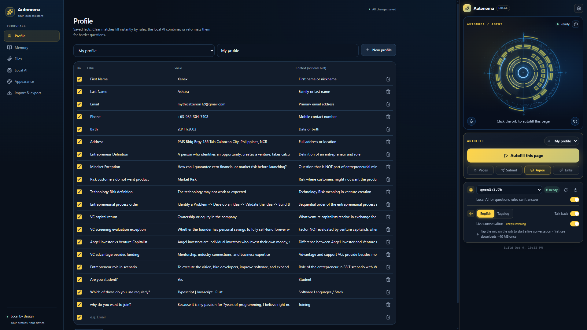
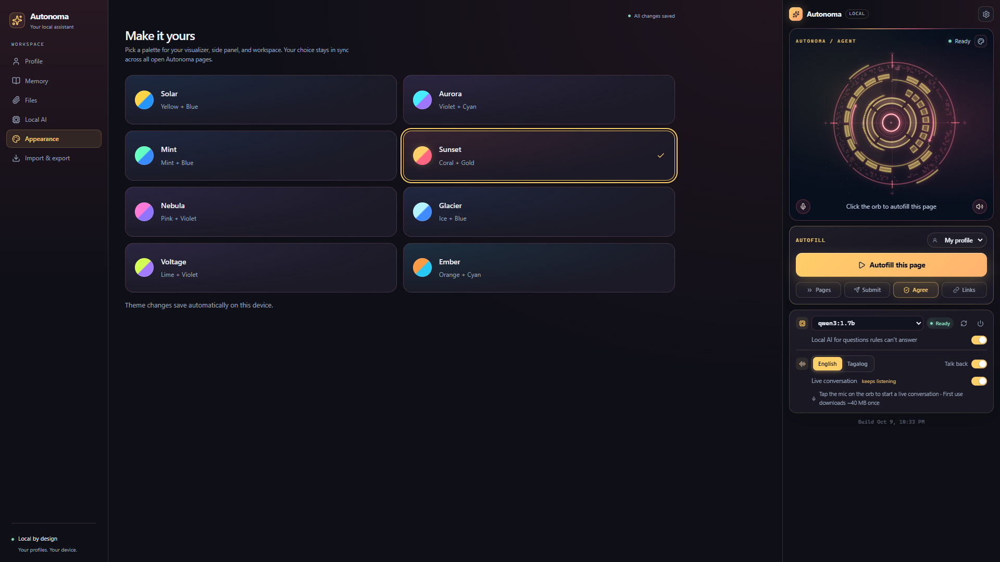
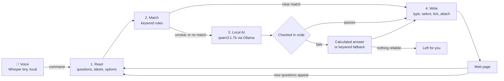

<!-- Time log (9 Oct 2026): created 6:22 PM by Claude Code · last changed 2:05 AM, 10 Oct (Expresso repository, submission sheet) -->
# Autonoma

**A Chrome extension that fills web forms for you, by click, by voice or by sign language, using small AI models that run entirely on your own computer.**

You save your details once: your profile, a few facts about yourself, your résumé. Autonoma then fills forms on any website, including Google Forms and multi-page applications.

- Exact matches are filled instantly by rules.
- Harder questions go to a local AI model through [Ollama](https://ollama.com).
- You can also just **talk to it**, in English or Tagalog: *"fill the email"*, *"fill this"*, *"punan mo ang form"*.
- Or **sign to it** with your own signs (shoulders, arms and hands, like FSL). You record and train them in **[Expresso](https://github.com/Jullemyth122/Expresso)**, a small companion web app (its own repository), and Autonoma only recognises them.

Everything runs on your machine: no account, no API key, no subscription, and nothing is sent to the cloud.

> Built in one day for a hackathon (9 October 2026).
> - [TIMELOG.md](TIMELOG.md): when each file was made.
> - [DATA_AND_MODELS.md](DATA_AND_MODELS.md): every model, rule and test sample used. **Autonoma trains nothing.** The only trained model is the sign model *you* train on your own signs in Expresso.
> - [CHANGELOG.md](CHANGELOG.md): what's new in this update.
> - **[SUBMISSION.md](SUBMISSION.md): the hackathon submission sheet** (models, technologies, what runs locally, why local AI).
> - **Two repositories:** this one (the extension) and **[Expresso](https://github.com/Jullemyth122/Expresso)** (record and train your signs). Clone them side by side: `Hackathon/Autonoma` and `Hackathon/Expresso`.

---

## Screenshots

**Workspace: Profile.** Saved facts, one compact row each (here with quiz answers), next to the side panel with the 3D agent orb, the command dock and the system card.



**Workspace: Appearance.** 8 colour themes; the orb, side panel and workspace change together (Sunset shown).



---

## Contents

- [Screenshots](#screenshots)
- [What it can do](#what-it-can-do)
- [How it works](#how-it-works)
- [Setup](#setup)
- [The side panel](#the-side-panel)
- [Try the demo](#try-the-demo)
- [Voice](#voice)
- [Sign mode](#sign-mode)
- [Using it on real forms](#using-it-on-real-forms)
- [Choosing the AI model](#choosing-the-ai-model)
- [Performance](#performance)
- [Checks and tests](#checks-and-tests)
- [Project structure](#project-structure)
- [Troubleshooting](#troubleshooting)
- [Limitations](#limitations)
- [Time log](#time-log)

---

## What it can do

| Feature | What happens |
| --- | --- |
| **Rules first** | Clear matches ("First name", "Email", "Country") are filled instantly from your profile, marked with a green **Filled** badge. |
| **Local AI for the rest** | Questions the rules can't answer go to `qwen3:1.7b` on your own computer and are marked with a purple **AI** badge. Examples: "Full name (Surname, First Name M.I.)", "Are you a student?", "Why do you want to join?", and quiz questions answered from your saved notes. |
| **Calculated facts** | The AI gets your **age** and **next birthday**, worked out from your saved birthday, plus **today's date**, so "How old are you?", "Age group: 18-25" and "When is your next birthday?" are always right. |
| **Sign mode** | Turn on the camera and sign a command: *FILL THIS PAGE*, *FILL THIS PHONE NUMBER*, *WHAT IS MISSING*, *NEXT*. Signs are your own, trained in Expresso, and read through the same rules as voice. **SUBMIT** waits for a **YES** sign. |
| **Targeted fills** | Fill just one thing, or a few: *"fill the email"*, *"fill the name and the phone"*, or *"fill this"* for the question you last clicked or the one in the middle of the screen. It works for text boxes, dropdowns, radio buttons and checkboxes. The targeted field glows while it's filled. |
| **Voice commands** | Tap the 🎤 on the orb and speak, in English or simple Tagalog. Speech is turned into text **on your computer** (Whisper tiny). No training needed. |
| **Live conversation** *(optional)* | One tap keeps the agent listening for command after command, until you say *"stop listening"* or *"tama na"*. |
| **Talks back** | The agent says what it did: how many fields it filled and which questions are left for you, by name, in **English or Tagalog**, using your computer's own voices. Tap the orb or the mic, or press **Esc**, to cut it short. |
| **Pagination** | Fills a page, clicks **Next**, and continues to the end. It never skips a required question: if it can't answer one, it stops and names it. |
| **Auto-submit** *(optional)* | Clicks **Submit** on the last page and checks that the form really was submitted. |
| **Agreement boxes** *(optional)* | Recognises "I agree to the terms", "code of conduct", "privacy policy" and similar boxes on any form. It ticks them only if you turn this on; the AI never decides. |
| **File uploads** | Attaches your saved résumé or other files to matching upload fields by name and file type, with no AI involved. |
| **Multi-Link** | Paste several form links and they're filled in background tabs. |
| **Dates and options** | Converts saved dates such as `20/11/2003` into what date fields accept, and picks "Philippines" from a country list even when your saved value is a full address. |
| **Fill report** | After each run: a stat bar of fields filled by rules, by AI and repaired; the questions that still need you; time taken; and tokens used. |
| **Premium side panel** | A 3D agent orb with 8 colour themes, a compact command dock, and one dense settings card. The whole panel fits on one screen. |
| **Copy-paste backup** | All your data as editable JSON: copy it, paste it back, or download it as a file. |

### Built-in safeguards

A 1.7-billion-parameter model is small, so the extension checks every AI answer in code before typing it:

- **No invented words:** every word in a short answer must come from your saved data, so names copied from the prompt's example are rejected.
- **No invented choices:** a Yes/No or multiple-choice answer must be backed by something you saved; otherwise the question is left for you. A quiz option counts as backed when most of its words (75%) appear in your saved answers.
- **No echoes:** an answer that just repeats the question text is rejected.
- **Age checks:** an age must be a number of years, and an age-group choice must contain your age.
- **Retyping slips:** an answer one character off a saved value (an extra digit, say) is restored to the saved value.
- **Never agrees for you** unless you turn on agreement boxes.
- **Never moves past an empty required question.**
- **Voice can't run away with itself:** in live mode it only listens when it's your turn, ignores background chatter silently, and treats sounds shorter than about 0.4 s as noise.

---

## How it works



1. **Read** (`src/content/read.ts`): finds every question on the page, including Google Forms, React/MUI forms, custom checkboxes and radios, shadow DOM, and iframes.
2. **Match** (`src/content/matching.ts`): scores each question against your profile labels. Strong matches are written immediately. For targeted fills it also picks *which* questions you meant (birthday ↔ date of birth, phone ↔ mobile…).
3. **Local AI** (`src/services/aiService.ts`): unclear questions are sent in one batch to Ollama at `http://127.0.0.1:11434`. The model returns structured JSON, and every answer is checked before use.
4. **Write** (`src/content/write.ts`): types values the way a person would, so React and Google Forms register them; picks options; ticks boxes; attaches files; adds the Filled / AI / Fixed badge.

**Voice** (`src/ui/voice/`): Whisper tiny turns your speech into text in a background worker. Hand-written English/Tagalog rules turn the text into commands. Anything they don't recognise goes to qwen to work out what you meant.

**Rules for exact, high-stakes things; AI for the fuzzy middle.** Names, ages, dates, files and agreement boxes are handled by code. Composing, choosing and short writing go to the AI.

---

## Setup

### What you need

| | Version used |
| --- | --- |
| Windows, macOS or Linux | Built and tested on Windows 11 |
| Google Chrome | 120 or newer (other Chromium browsers untested) |
| [Node.js](https://nodejs.org) | 24 (22.18 or newer works) |
| [Ollama](https://ollama.com/download) | 0.40.2 |
| GPU *(optional)* | Tested on an RTX 3050 laptop GPU with 4 GB; CPU-only works but is slower |
| Memory | 8 GB laptop works; keep about 2 GB free while filling (close Docker, Discord, extra tabs) |

### 1. Install Ollama and the model

1. Install Ollama from **https://ollama.com/download** and start it. It runs in the system tray (Windows) or menu bar (macOS).
2. Download the model (about 1.4 GB), then check that it's installed:
   ```bash
   ollama pull qwen3:1.7b
   ollama list
   ```

### 2. Let the extension talk to Ollama (important)

By default Ollama **blocks requests from browser extensions** with HTTP 403, and the panel then shows *"Ollama blocked this extension"*. Allow Chrome extensions once.

**Windows (PowerShell):**
```powershell
setx OLLAMA_ORIGINS "chrome-extension://*"
```
Then **quit Ollama from the system tray and start it again**. It only reads this setting when it starts.

**macOS:**
```bash
launchctl setenv OLLAMA_ORIGINS "chrome-extension://*"
```
Then quit and reopen the Ollama app.

**Linux (systemd):** run `sudo systemctl edit ollama.service`, add the two lines below, then run `sudo systemctl restart ollama`.
```ini
[Service]
Environment="OLLAMA_ORIGINS=chrome-extension://*"
```

> To allow only Autonoma instead of every extension, use `chrome-extension://<your-extension-id>`. The ID is shown on `chrome://extensions` and in Autonoma's **Local AI** settings page.

### 3. Build the extension

```bash
git clone https://github.com/Jullemyth122/Autonoma.git
cd Autonoma
npm install
npm run build
```

This creates the `dist/` folder, which is the extension. It's about 23 MB, most of it the speech runtime.

### 4. Load it in Chrome

1. Open `chrome://extensions`.
2. Turn on **Developer mode** (top right).
3. Click **Load unpacked** and select the `dist` folder.
4. Pin Autonoma and click its icon to open the **side panel**.

The panel's model pill should show a green **Ready**. After you change the code and run `npm run build` again, click the **reload** icon on Autonoma in `chrome://extensions`. The panel's footer shows the build time, so you can confirm Chrome loaded the new version.

---

## The side panel

```text
┌──────────────────────────────────────────┐
│ ✦ Autonoma  LOCAL                    ⚙   │  header · ⚙ opens the Workspace
├──────────────────────────────────────────┤
│ AUTONOMA / AGENT          ● Ready   🎨   │  🎨 = 8 colour themes
│              ( 3D agent orb )            │  click the orb = autofill
│ 🎤      Click the orb to autofill     🔊 │  🎤 = voice · 🔊 = mute
├──────────────────────────────────────────┤
│ AUTOFILL                 👤 My profile ▾ │
│ [        ▶  Autofill this page        ]  │
│ [» Pages] [➤ Submit] [🛡 Agree] [🔗 Links]│  option chips
├──────────────────────────────────────────┤
│ 13 fields filled                   6.2s  │  report: rules / AI / fixed
│ ████████████░░░░░  ● rules ● AI ● fixed  │
│ NEEDS YOU  Code of conduct               │
├──────────────────────────────────────────┤
│ ▣ qwen3:1.7b ▾        ● Ready   ↻   ⏻    │  model · check · release memory
│   Local AI for questions rules can't …  ◉│
│ ♪ [English|Tagalog]          Talk back ◉ │
│   Live conversation  keeps listening   ◯ │
│   🎤 Tap the mic on the orb · …          │  what you said / hints
└──────────────────────────────────────────┘
```

| Control | Default | What it does |
| --- | --- | --- |
| **Orb** | — | Click to autofill the page. While the agent talks, click it to stop the talking. |
| **🎨** (on the orb) | Solar | 8 colour themes: Solar, Aurora, Mint, Sunset, Nebula, Glacier, Voltage, Ember. Also in Workspace → Appearance. |
| **🎤** (on the orb) | — | One voice command. With *Live conversation* on, it starts and ends a live session. While the agent talks, tap it to stop the talking. |
| **🔊** (on the orb) | On | Mutes the orb's sound and the agent's voice. |
| **Profile pill** | — | Which saved profile to fill from. |
| **Pages** chip | Off | Clicks **Next** through multi-page forms. |
| **Submit** chip | Off | Clicks **Submit** on the last page, then checks the page really changed. |
| **Agree** chip | Off | Ticks terms, consent, privacy and code-of-conduct boxes on your behalf. |
| **Links** chip | — | Opens Multi-Link: paste several form links to fill in background tabs. |
| **Model** ▾ / ↻ / ⏻ | qwen3:1.7b | Pick an installed model, check Ollama again, release the model's GPU/RAM. |
| **Local AI** switch | On | Off = rules and keyword matches only (very fast). |
| **English / Tagalog** | English | Language for talking back and voice commands. |
| **Talk back** switch | On | The agent says what it did after each fill. |
| **Live conversation** switch | Off | Keeps listening for command after command. |
| **Esc** key | — | Stops the agent talking. |

Closing the side panel does **not** stop a fill. Use **Stop** (shown while filling) to cancel.

---

## Try the demo

The repo includes three demo forms. Start the demo server, then open them at **http://127.0.0.1:5500** (extensions can't run on `file://` pages):

```bash
npm run demo
```

| Page | What it is |
| --- | --- |
| `/` (`demo/index.html`) | Two-page hackathon registration: text, email, phone, a composed name, a date, a country select, a conditional radio question, checkboxes, a long answer, a PDF upload and a code-of-conduct box. Every question is required. |
| `/index2.html` | Job application: *Senior Product Engineer, Acme Labs* (20 fields) |
| `/index3.html` | *PSA Birth Certificate Online Request* (24 fields) |

1. In the side panel, click **⚙** to open the Workspace. Go to **Import & export** and click **Add demo profile**. This adds "Maria Santos", a fictional profile with memories and a sample résumé, and makes it active.
2. Back in the side panel, turn on the **Pages** chip, then click **Autofill this page** or the orb.

**What you'll see** (measured on the laptop above, with the model already loaded):

- Page 1: name, email and country are filled by rules (green **Filled**). Mobile number, the certificate name **"SANTOS, Maria R."** and the date of birth are filled by AI (purple **AI**).
- It clicks **Next** by itself.
- Page 2: "Are you a student?" → **Yes**. That reveals **university** and **year level**, which are then filled from memory. The languages **TypeScript, React, Python** are ticked, a short **"why I want to join"** is written from memory, and the **résumé PDF** is attached.
- It **stops before Submit** with *"Stopped: ‘Code of conduct’ is required and needs your answer"*, because it never agrees to terms unless you allow it.
- Both pages take about **6–7 seconds**, and the agent tells you what it did.

**Try these too:**

- Turn on **Agree** and **Submit**, then run it again. It ticks the code of conduct, submits, and reports *"Form submitted."*
- Click the 🎤 and say *"fill the email"*. Only the email is filled, and it glows.
- Click a question's text (say, "Are you currently a student?"), click the 🎤 and say *"fill this"*.
- Turn on **Live conversation**, tap the 🎤 once, and say *"fill the name and the email"* … *"fill the birthday"* … *"stop listening"*.
- Quit Ollama and run it again. Clear matches are still filled in about 1 second, and the model pill says **Offline**.
- **Turn off Wi-Fi.** Everything keeps working, because it's all local.

---

## Voice

**Talking back** is on by default (the *Talk back* switch). Choose **English** or **Tagalog** next to it. Windows has English voices built in; a Tagalog line is read by an English voice unless you add a Filipino voice in Windows' speech settings. To stop the agent mid-sentence, **tap the orb or the 🎤, or press Esc**. The 🔊 button mutes it.

**Voice commands:** tap the 🎤 at the bottom left of the orb, say the command, and pause. It stops listening by itself.

| English | Tagalog | Does |
| --- | --- | --- |
| fill this form / autofill | punan mo ang form / sagutan | Fills the page |
| fill the email / fill my first name / fill the birthday | punan ang email / punan ang pangalan / punan mo ang kaarawan ko | Fills **only** that question. Synonyms count: birthday ↔ date of birth, phone ↔ mobile, pangalan → name, apelyido → last name. The field glows while it's filled. |
| fill first name and last name · fill this name, this email and the phone · fill the name then the email | punan ang pangalan at email · punan mo ang email, tapos ang kaarawan | **Several questions in one sentence** |
| fill this / fill that one | punan mo ito | Fills the question you last clicked (its text, card, an option or a box), or the one in the middle of the screen if you've scrolled since. Works for text, dropdowns, radios and checkboxes. |
| fill all pages | punan lahat | Fills and clicks Next through the form |
| next | susunod / tuloy | Clicks Next |
| submit | ipasa / isumite | Clicks Submit, then checks it went through |
| stop | itigil | Cancels a fill (in a live session with nothing filling, ends the session) |
| stop listening / that's all | tama na / tapos na / salamat | Ends a live conversation |
| what's left? | ano pa ang kulang? | Reads the questions left for you |
| use *profile name* | gamitin ang *profile name* | Switches profile |
| speak Tagalog / speak English | | Switches the voice language |
| help | tulong | Lists the commands |

**Mishearings are forgiven.** A small model mishears short commands, so these are fixed before matching:
- "Feel / Phil the email" → fill.
- "Panan" → punan.
- "1st name" → first name.

Sentences the rules don't recognise go to qwen, which can also return several fields at once.

**Live conversation** (the *Live conversation* switch): one tap on the 🎤 starts a session that keeps listening. Say one thing after another. To end it, say **"stop listening"** or **"tama na"**, or tap the mic again. Rules that keep it well-behaved:
- **One microphone stays open** for the whole session, but sound is only collected while it's **your turn**, never while the agent is talking or filling, so it can't hear itself.
- Background talk that isn't a command is ignored **silently**; you'll see it under "You said …".
- After about 2 minutes of silence it ends **quietly**.

**Under the hood:**
- **Whisper tiny** (multilingual) turns your voice into text inside the extension: on the GPU when it works, otherwise on the CPU, in about 1–8 seconds.
- **First use downloads the speech model (~40 MB) once** from Hugging Face; it's cached after that. You can download it ahead of time under Workspace → Local AI → **Voice commands**.
- **Microphone permission:** the side panel can't show Chrome's permission prompt. If the microphone is blocked, Autonoma opens Workspace → Local AI, where you click **Allow microphone** once.
- **No voice training:** the model is pretrained, and the commands are a fixed phrase list.

---

## Sign mode

Command Autonoma with **your own signs**: real movements of the shoulders, arms and hands, like Filipino Sign Language, not just hand shapes. The work is split in two so the extension stays light:

| | **[Expresso](https://github.com/Jullemyth122/Expresso)** (a local web app; clone it next to this folder) | **Autonoma** (this extension) |
| --- | --- | --- |
| Does | Records your signs with the webcam, **trains** a small model on your CPU, lets you test it live, exports it | Only **recognises** signs and runs the matching command |
| Runs | `npm run dev` → http://127.0.0.1:5180 (Record · Train · Test · Export) | A switch in the side panel; the camera is on only while Sign mode is on |
| Heavy parts | PyTorch for training (in its own `ml/venv`) | Nothing heavy: MediaPipe hand + pose tracking and a ~0.9 MB ONNX model, all in a **background worker** |

**How to set it up:**
1. In Expresso, **Record** each sign about 15 times: raise your hands, sign, drop your hands. Also record `_none` (random movements such as scratching or reaching for the mouse) so ordinary movement isn't mistaken for a command.
2. **Train**, check the per-sign accuracy, then **Test** it live.
3. **Export → Copy and rebuild Autonoma**, then reload the extension in `chrome://extensions`.
4. In Autonoma's Workspace → **Signs**, click **Allow camera** once (the side panel can't show Chrome's prompt). **Run self-test** checks that the extension gives the same answers as the trainer.
5. Switch on **Sign mode** in the side panel's system card.

**Signs are commands by name.** A sign's name is read as if you'd said it and goes through the same rules as voice. That's why *FILL THIS EMAIL* fills the email, and why you can add, remove or rename signs in Expresso without changing any code:

| Sign | Does |
| --- | --- |
| FILL THIS PAGE · FILL THIS FORM | Fills the page |
| FILL THIS | Fills the question you last clicked, or the one mid-screen |
| FILL THIS FULL NAME · FILL THIS EMAIL · FILL THIS PHONE NUMBER · FILL THIS *anything* | Fills only that question |
| FILL ALL PAGES · NEXT · STOP | As with voice |
| WHAT IS MISSING | Reads out what's still empty |
| SUBMIT | Asks first; it submits only after a **YES** sign within 15 s (**NO** cancels) |
| `_none` | Never acted on |

**The camera is hidden by default.** It keeps running, and the **orb** is your feedback: *Reading your sign…* while your hands are up, then *Signed “FILL THIS PAGE” · 92%* or *Not sure… sign it again*. A small camera button above the orb's 🎤 (a red dot means the camera is on) shows or hides the preview.

**Rules that keep it safe and smooth:**
- A sign is acted on only when the model is at least **60% sure** (adjustable in Workspace → Signs). Below that, the chip shows the guess greyed out and nothing happens.
- The same sign caught twice within 1.5 s counts once. While one sign's fill runs, other signs wait; **STOP** always goes through.
- The camera pauses while Whisper is turning speech into text, so the two models never compete for the CPU.
- Turning Sign mode off stops the camera and ends the worker, which frees all its memory.

**Under the hood:**
- **Camera and worker.** The camera runs in the side panel. Each frame is shrunk to 640 px and handed to a worker; a frame that arrives while the worker is busy is skipped, never queued.
- **Tracking.** The worker runs MediaPipe hand and pose landmarks (GPU, or CPU if the GPU fails) and turns each frame into 142 numbers: shoulders, elbows, wrists and 21 points per hand, normalised to your shoulder width.
- **Cutting signs.** It cuts out a sign when you drop your hands or hold still, resamples it to 32 frames and classifies it with your ONNX model.
- **Same code as Expresso.** It uses the feature and segmenter code from Expresso, and the same ONNX Runtime the speech model already ships (no second 21 MB runtime).

---

## Using it on real forms

### Your data (⚙ Workspace)

| Section | What to put there |
| --- | --- |
| **Profile** | One row per fact: **Label** (e.g. `Email`), **Value**, and an optional **Context** hint (e.g. `work email`). Untick **On** to leave a field out. Make separate profiles with **New profile**. Rows are compact; their borders show when you hover or type. |
| **Memory** | Short facts the AI writes answers from, e.g. *"3rd-year BSIT student at …"*, *"I use TypeScript and React daily"*, *"I join hackathons to …"*. **Without memories, open questions are left for you.** |
| **Files** | Your résumé or other files. Give each a context such as `resume CV`. They're attached by name, context and accepted type, with no AI involved. |
| **Local AI** | Model, use AI on or off, auto-submit, agreement boxes, typing speed, microphone permission, speech model download, and setup help. |
| **Appearance** | The 8 colour themes, shared with the side panel. |
| **Import & export** | All your data as JSON. **Copy** it, paste edited JSON and **Apply**, or **Download** / **Load** a file. Exports are not encrypted. |

**Tips:**

- Save your birthday in a field whose label or context mentions *birth*, *DOB* or *birthday*. Age and next birthday are calculated from it.
- Save country on its own, e.g. `Country → Philippines`, as well as your full address.
- For multi-choice answers, separate items with commas or `|`, e.g. `TypeScript | React | Rust`. Choices a form doesn't offer are skipped.
- **Quizzes:** save each answer as a field, with the question as its context. The AI then picks the matching option, even when the wording differs a little.
- Long quiz-style fields make every AI request longer. Turn them off, or keep them in a separate profile, when you don't need them.
- **Typing speed:** *Instant* is fastest. *Visible* (40 ms per character) types letter by letter, for show.

---

## Choosing the AI model

Measured on an RTX 3050 laptop GPU (4 GB) with Chrome open:

| Model | Fits on GPU | First request | Each batch after | Accuracy on our forms |
| --- | --- | --- | --- | --- |
| **`qwen3:1.7b`** ✅ recommended | 100% GPU, 1.7 GB | ~8 s | **0.5–1.6 s** | Correct; makes nothing up thanks to the checks |
| `qwen3:4b` | Only 67%; the rest runs on the CPU | ~41 s | 8–20 s | No better; got a birth year wrong |
| `gemma3:1b` | Yes | ~6 s | ~1 s | Wrong answers (e.g. "No" for a student) |

On a GPU with 8 GB or more, `qwen3:4b` may be worth trying. Pick the model in the panel or under **Local AI**. Only models installed in Ollama are listed.

---

## Performance

Measured in Chromium with Chrome's performance counters:

| What | Result |
| --- | --- |
| **Normal browsing** (every site gets the 18 KB page script) | **+2 ms** per page load; idle cost 0.03% → 0.05% of one core. Not noticeable. |
| Fill 50 fields (rules) | **1.1 s** |
| Fill 300 fields (rules) | **4.0 s** |
| Side panel idle (animated orb) | **6.4%** of one core. The orb draws at 30 fps when idle and 60 fps only while working, listening or talking. |
| First AI answer after a while | ~8 s while qwen loads into the GPU; ~1 s after that (it stays loaded for 2 minutes) |

The heavy parts load only in the side panel, and only when needed:
- the 3D orb: 910 KB;
- the speech engine: 866 KB plus a 21 MB runtime, loaded on first 🎤 use;
- Sign mode: a 540 KB worker plus MediaPipe (13 MB of wasm and 13 MB of tracking models), loaded only while Sign mode is on. It shares the speech runtime.

**Sign mode cost** (measured in headless Chromium with software graphics, with a real FSL clip as the fake camera):

| What | Result |
| --- | --- |
| Frame timing on the form page while signing | p50 **16.7 ms**, p95 **17.2 ms**, the same as with Sign mode off (60 fps) |
| Side panel main thread | 1 long task (92 ms) in the whole run: the start-up. Tracking and the model run in the worker. |
| Start-up (camera + MediaPipe + model) | ~2.7 s |
| Tracking speed | 13 fps on software graphics; expect more on a real GPU. Signs are resampled, so speed doesn't change the answer. |
| Self-test (5 clips) | ~0.8 s, all 5 identical to the Python trainer |

The test browser drew the orb in software; on a real GPU its CPU use is lower.

---

## Checks and tests

```bash
npm run lint         # ESLint on src/
npm run match:check  # keyword matching, options, dates, age (runs matching.ts directly in Node)
npm run build        # type check + production build into dist/
```

`match:check` runs 39 cases, including:

- "Surname" → Last Name
- "Which university do you attend?" must **not** match "Which of these do you use?"
- `20/11/2003` → `2003-11-20`; `05/06/2003` is ambiguous and left for the AI
- An address ending in "Philippines" selects **Philippines**
- Born 20 Nov 2003 → **22** on 9 Oct 2026
- `Typescript | Javascript | Rust` → **TypeScript, Rust**

These were checked in a real Chromium browser with the extension loaded:
- the full two-page demo fill;
- targeted and "fill this" fills on text, radio, checkbox and dropdown questions;
- voice commands from recorded speech, in English and Tagalog;
- a live conversation with three commands;
- interrupting the agent;
- background chatter ignored in live mode;
- **Sign mode:** a real FSL-105 clip played as a fake camera through the real extension. The worker tracks the signer, cuts out the sign and classifies it; *FILL THIS PAGE* filled the demo form (5 by rules, 2 by AI). The self-test matched the trainer 5/5, and turning Sign mode off removed the camera. These ran with a synthetic test model; your real model comes from Expresso.

[DATA_AND_MODELS.md](DATA_AND_MODELS.md) lists every recording and result.

---

## Project structure

```text
Autonoma/
├── public/
│   ├── manifest.json            Chrome extension manifest (MV3)
│   ├── mediapipe/               Hand and pose tracking models for Sign mode (the wasm is copied from node_modules at build)
│   ├── sign/                    Your sign model, exported by Expresso (git-ignored: it's learnt from your body)
│   └── sounds/orb-startup.mp3   Orb startup sound
├── src/
│   ├── background/
│   │   └── background.ts        Fill jobs, Pagination, Multi-Link, Next/Submit by voice, Submit check, AI requests
│   ├── content/                 Runs inside web pages
│   │   ├── content.ts           Fill flow: rules → AI → fallback → repair; targeted fills; "fill this"; agreement boxes
│   │   ├── read.ts              Finds questions, labels, options (incl. Google Forms)
│   │   ├── matching.ts          Keyword matching, target selection, options, dates, age
│   │   └── write.ts             Types, selects, ticks, attaches files, badges, glow
│   ├── services/
│   │   ├── aiService.ts         Ollama client, prompt, answer checks, calculated facts, voice-command fallback
│   │   ├── repository.ts        Saves data in chrome.storage.local
│   │   └── vault.ts             Validates saved and imported data
│   ├── types/                   Shared types and defaults (default model: qwen3:1.7b)
│   ├── ui/
│   │   ├── Panel.tsx            Side panel: command dock, system card, voice and live sessions
│   │   ├── Workspace.tsx        Profile, Memory, Files, Local AI, Signs, Appearance, Import & export
│   │   ├── SignSetup.tsx        Workspace → Signs: camera permission, model info, self-test, settings
│   │   ├── Report.tsx           Fill report (stat bar, "Needs you")
│   │   ├── ThemePicker.tsx      Theme dots (orb popover) and list (Appearance)
│   │   ├── theme.ts             Shared theme state
│   │   ├── orb/                 3D agent orb (three.js / react-three-fiber), 8 themes, sound
│   │   ├── voice/               Talking back, microphone, Whisper worker, command rules (EN + TL)
│   │   ├── sign/                Sign mode: camera hook, worker (MediaPipe → segmenter → ONNX), features shared with Expresso
│   │   ├── api.ts               Messages to the background; state hooks
│   │   ├── sample.ts            Demo profile ("Maria Santos")
│   │   └── *.module.scss, styles/global.scss   Styles
│   └── main.tsx                 Starts the panel or the workspace
├── demo/                        index.html (registration), index2.html (job application), index3.html (PSA request)
├── docs/screenshots/            README screenshots
├── scripts/
│   ├── build.mjs                Builds pages + content script + service worker; ships the speech runtime
│   ├── serve-demo.mjs           Serves the demo on 127.0.0.1:5500
│   ├── match-check.mjs          Matching checks
│   └── match-cases.json         Test cases
├── CHANGELOG.md                 What's new in this update
├── SUBMISSION.md                Hackathon submission sheet
├── DATA_AND_MODELS.md           Models used (not trained), rules, test samples
├── PROJECT_SETUP.md             Original plan, design decisions, what changed
├── TIMELOG.md                   When each file was created and changed
└── README.md                    This file
```

**Tech:**
- **UI:** React 19 · TypeScript · SCSS modules · Vite · three.js / react-three-fiber.
- **Extension:** Chrome Manifest V3.
- **Form AI:** Ollama (`/api/chat` with JSON-schema output and streaming).
- **Speech:** transformers.js 3.8.1 + ONNX Runtime Web (Whisper tiny).
- **Signs:** MediaPipe Tasks Vision 1.1.0 (hand + pose landmarks) + ONNX Runtime Web; trained in Expresso with PyTorch.

---

## Troubleshooting

| You see | Fix |
| --- | --- |
| **Ollama is not running** | Start the Ollama app, then click ↻ in the panel. |
| **Ollama blocked this extension** | Set `OLLAMA_ORIGINS` (see [Setup step 2](#2-let-the-extension-talk-to-ollama-important)), then **quit and restart** Ollama. Setting it without a restart does nothing. |
| **qwen3:1.7b (not installed)** | `ollama pull qwen3:1.7b`, or pick an installed model. |
| **Ollama could not load the model (HTTP 500)** or a **CUDA error** | Usually low memory or a stuck GPU runner. Close Docker Desktop, Discord and extra tabs, click ⏻, or quit and restart Ollama. |
| **Speech model failed to load** | First use needs internet once (~40 MB). Also check free memory, then tap 🎤 again. On some GPUs it falls back to the CPU automatically; that's slower but works. |
| **Refresh this webpage after loading the extension** | Refresh the form tab. Browser pages such as `chrome://` can't be filled. |
| **Stopped: "…" is required and needs your answer** | Working as intended: nothing you saved answers that question. Answer it yourself, or add a field, memory or file for it. |
| **"Fill this" fills the wrong question** | Click the question's text (not an empty part of the page) right before speaking, or scroll it to the middle of the screen. |
| **No sign model yet** | Train in Expresso, press **Export**, rebuild Autonoma (Expresso can do it), then reload the extension. |
| **Sign mode: camera blocked** | Autonoma opens Workspace → Signs: click **Allow camera**, then switch Sign mode on again. |
| **Signs are missed or mixed up** | Record more of the confused signs (Expresso's Train tab lists the mix-ups) and add `_none` recordings. Sit so your shoulders and both hands are in view, in good light. Lowering the confidence in Workspace → Signs accepts more, but makes more mistakes. |
| **The agent keeps talking** | Tap the orb or the 🎤, or press **Esc**. |
| Changes don't show up | Reload Autonoma in `chrome://extensions` and check the build time in the panel footer. |
| The demo page doesn't fill | Open it at `http://127.0.0.1:5500` (`npm run demo`), not as a file. |

---

## Limitations

- **Google Forms file uploads** use Google's own Drive picker in a separate frame, which extensions can't fill. Normal upload fields on other sites work.
- The AI only knows what you've saved. **Without memories, open questions are left for you.**
- Long free-text answers from a 1.7B model can be generic. Read them before submitting.
- Whisper tiny sometimes mishears short commands. Common slips are corrected, but a clear, steady voice works best. A real Filipino speaker is understood better than the computer voice used in testing.
- In live mode, anything you say **while the agent is talking or filling** is ignored, so it can't hear itself. Tap or press Esc to cut it short.
- Data is stored **unencrypted** in the browser's extension storage, readable only by Autonoma's own pages. JSON exports aren't encrypted either.
- **Sign mode knows one signer.** A model trained only on you works less well for other people, other cameras or other lighting. Signs mostly below the chest are treated as "hands down", and crossing your hands can swap left and right. Phrases such as FILL THIS PHONE NUMBER are learnt as one whole sign, not word by word.
- Sign mode wasn't tried with a person signing live: the tests used a recorded FSL clip and a synthetic model. The accuracy you get depends on your recordings.
- **Agree** ticks whatever terms a form shows. Keep it off for real applications unless you've read them.

---

## Time log

Built on **9 October 2026**, finishing just after midnight (times are local, UTC+8):

| Time | What |
| --- | --- |
| Before 3:04 PM | **Codex:** project plan (`PROJECT_SETUP.md`) and the first fill engine: background worker, content scripts, Ollama service, types. |
| 3:04–5:52 PM | **Claude Code session:** React UI (side panel and workspace), demo form, match checks, Ollama setup and fixes, removal of the passphrase vault, dates / age / next birthday, Google Forms labels, name rules, JSON import/export, required-field stops, agreement-box setting. |
| 6:12 PM | **Orb UI** added to the side panel. |
| 6:22 PM | First README. |
| 6:40–7:50 PM | **Voice:** the agent talks back (English/Tagalog), then push-to-talk voice commands with Whisper tiny, running locally. |
| 7:58 PM | **DATA_AND_MODELS.md**: disclosure of models, rules and test samples. |
| 8:20–8:40 PM | **Targeted voice fills:** "fill the email", "fill the name", "fill this", in English and Tagalog; the targeted field glows. |
| 8:50 PM | **ChatGPT UI work:** 8 app themes, theme picker, restyled panel and workspace. |
| 9:00–9:12 PM | **Premium compact redesign** (`premium-ui` branch). |
| 9:15–9:45 PM | **Live conversation**; several fields per sentence. |
| 9:45–9:55 PM | **Performance pass:** fills 2–3× faster, HTTP report fix, lighter idle orb. |
| 9:57 PM | **Interrupt the agent** (orb, mic, Esc); live mode never speaks up on its own. |
| 10:15 PM | **"Fill this" for any question**, including radios and checkboxes; looser quiz-option check. |
| 10:25–10:30 PM | **Several fields per command, even when misheard** ("feel first name and last name"). |
| 10:36–10:38 PM | This README update and [CHANGELOG.md](CHANGELOG.md). |
| 10:47 PM | Screenshots of the Workspace (Profile, Appearance) with the side panel. |
| 11:23–11:37 PM | **Expresso** (new app next to Autonoma): record your own signs, train on your CPU, test live, export. |
| 11:38–11:59 PM | **Sign mode** in Autonoma: camera + worker recognition, Workspace → Signs, self-test, SUBMIT needs YES. |
| 12:00–12:15 AM (10 Oct) | Sign mode docs (this README, CHANGELOG, DATA_AND_MODELS, TIMELOG). |
| 12:30–1:09 AM | The developer recorded 12 signs (187 takes) in Expresso and trained the first real model (100% held-out), then exported it: self-test 12/12 in Autonoma. |
| 1:24 AM | Camera hidden by default in Sign mode; the orb shows what it reads; camera button by the mic. |
| 1:31–1:48 AM | **ChatGPT Codex** redesigned Expresso's UI (app shell, themes, icons, Inter font). |
| 1:33–1:45 AM | Low-memory fixes: the speech model falls back to the CPU when the GPU can't load it; a 3D-orb crash shows the flat orb instead of a blank panel; clearer camera errors. |
| 2:05 AM | Expresso made its own repository, both time logs completed, [SUBMISSION.md](SUBMISSION.md) written. |

Every code file starts with a one-line time-log comment, and **[TIMELOG.md](TIMELOG.md)** lists every file with its creation time, last change and purpose.

---

**Team:** [Jullemyth122](https://github.com/Jullemyth122) (Xenex Ashura) · built with help from Codex, ChatGPT and Claude Code. · Companion repository: **[Expresso](https://github.com/Jullemyth122/Expresso)**.
