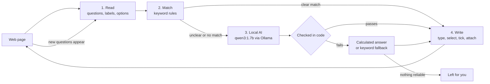

<!-- Time log (9 Oct 2026): created 6:22 PM by Claude Code -->
# Autonoma

**A Chrome extension that fills web forms for you, using a small AI model that runs entirely on your own computer.**

You save your details once: your profile, a few facts about yourself, your résumé. Autonoma then fills forms on any website, including Google Forms and multi-page applications. Exact matches are filled instantly by rules. Harder questions go to a local AI model running through [Ollama](https://ollama.com), so nothing is sent to the cloud. No account, no API key, no subscription.

> Built in one day for a hackathon (9 October 2026). See [TIMELOG.md](TIMELOG.md) for when each file was made, and [DATA_AND_MODELS.md](DATA_AND_MODELS.md) for every model, rule and test sample used. **No model was trained.**

---

## Contents

- [What it can do](#what-it-can-do)
- [How it works](#how-it-works)
- [Setup](#setup)
- [Try the demo](#try-the-demo)
- [Using it on real forms](#using-it-on-real-forms)
- [Choosing the AI model](#choosing-the-ai-model)
- [Checks and tests](#checks-and-tests)
- [Project structure](#project-structure)
- [Troubleshooting](#troubleshooting)
- [Limitations](#limitations)
- [Time log](#time-log)

---

## What it can do

| Feature | What happens |
| --- | --- |
| **Rules first** | Clear matches ("First name", "Email", "Country") are filled instantly from your profile, marked with a green **Filled** badge. |
| **Local AI for the rest** | Questions the rules can't answer go to `qwen3:1.7b` on your own computer and are marked with a purple **AI** badge. Examples: "Full name (Surname, First Name M.I.)", "Are you a student?", "Why do you want to join?". |
| **Calculated facts** | The AI gets your **age** and **next birthday**, worked out from your saved birthday, plus **today's date**. "How old are you?", "Age group: 18-25" and "When is your next birthday?" are therefore always right. |
| **Pagination** | Fills a page, clicks **Next**, and continues to the end. It never skips a required question: if it can't answer one, it stops and names it. |
| **Auto-submit** *(optional)* | Clicks **Submit** on the last page and checks that the form really was submitted. |
| **Agreement boxes** *(optional)* | Recognises "I agree to the terms", "code of conduct", "privacy policy" and similar boxes on any form. It ticks them only if you turn this on; the AI never decides. |
| **File uploads** | Attaches your saved résumé or other files to matching upload fields by name and file type, with no AI involved. |
| **Multi-Link** | Paste several form links and they're filled in background tabs. |
| **Dates and options** | Converts saved dates such as `20/11/2003` into what date fields accept, and picks "Philippines" from a country list even when your saved value is a full address. |
| **Fill report** | After each run: fields filled by rules, by AI, and repaired, plus questions left for you, time taken, and tokens used. |
| **Copy-paste backup** | All your data as editable JSON: copy it, paste it back, or download it as a file. |
| **Talks back** | The agent says what it did: how many fields it filled and which questions are left for you, by name, in **English or Tagalog**. It uses the voices already installed on your computer, so it needs nothing extra and works offline. |
| **Voice commands** | Click the 🎤 on the orb and speak, in English or simple Tagalog: *“fill this form”*, *“punan mo ang form”*, *“next”*, *“ipasa”*, *“what's left?”*… Speech is turned into text **on your computer** (Whisper tiny). No training is needed. |
| **Agent orb** | An animated 3D orb in the side panel shows what the agent is doing (Ready → Working → Done / Waiting on you). Click it to start. |

### Built-in safeguards

A 1.7-billion-parameter model is small, so the extension checks every AI answer in code before typing it:

- **No invented words:** every word in a short answer must come from your saved data, so names copied from the prompt's example are rejected.
- **No invented choices:** a Yes/No or multiple-choice answer must be backed by something you saved; otherwise the question is left for you.
- **No echoes:** an answer that just repeats the question text is rejected.
- **Age checks:** an age must be a number of years, and an age-group choice must contain your age.
- **Retyping slips:** an answer one character off a saved value (an extra digit, say) is restored to the saved value.
- **Never agrees for you** unless you turn on agreement boxes.
- **Never moves past an empty required question.**

---

## How it works



1. **Read** (`src/content/read.ts`): finds every question on the page, including Google Forms, React/MUI forms, custom checkboxes and radios, shadow DOM, and iframes.
2. **Match** (`src/content/matching.ts`): scores each question against your profile labels. Strong matches are written immediately.
3. **Local AI** (`src/services/aiService.ts`): unclear questions are sent in one batch to Ollama at `http://127.0.0.1:11434`. The model returns structured JSON, and every answer is checked before use.
4. **Write** (`src/content/write.ts`): types values the way a person would, so React and Google Forms register them; picks options; ticks boxes; attaches files; adds the Filled / AI / Fixed badge.

Rejected values go through rule-based repair first, then AI repair. Newly revealed questions, such as "Which university?" after you answer "Yes" to "Are you a student?", are picked up on the next pass.

**Rules for exact, high-stakes things; AI for the fuzzy middle.** Names, ages, dates, files and agreement boxes are handled by code. Composing, choosing and short writing go to the AI.

---

## Setup

### What you need

| | Version used |
| --- | --- |
| Windows, macOS or Linux | Built and tested on Windows 11 |
| Google Chrome | 120 or newer (other Chromium browsers untested) |
| [Node.js](https://nodejs.org) | 24 (22.18 or newer works) |
| [Ollama](https://ollama.com/download) | 0.40.2 |
| GPU *(optional)* | Tested on an RTX 3050 laptop GPU with 4 GB; CPU-only works but is slower |

### 1. Install Ollama and the model

1. Install Ollama from **https://ollama.com/download** and start it. It runs in the system tray (Windows) or menu bar (macOS).
2. Download the model, about 1.4 GB:
   ```bash
   ollama pull qwen3:1.7b
   ```
3. Check that it's installed:
   ```bash
   ollama list
   ```

### 2. Let the extension talk to Ollama (important)

By default Ollama **blocks requests from browser extensions** with HTTP 403, and the panel then shows *"Ollama blocked this extension"*. Allow Chrome extensions once.

**Windows (PowerShell):**
```powershell
setx OLLAMA_ORIGINS "chrome-extension://*"
```
Then **quit Ollama from the system tray and start it again**. It only reads this setting when it starts.

**macOS:**
```bash
launchctl setenv OLLAMA_ORIGINS "chrome-extension://*"
```
Then quit and reopen the Ollama app.

**Linux (systemd):** run `sudo systemctl edit ollama.service`, add the two lines below, then run `sudo systemctl restart ollama`.
```ini
[Service]
Environment="OLLAMA_ORIGINS=chrome-extension://*"
```

> To allow only Autonoma instead of every extension, use `chrome-extension://<your-extension-id>`. The ID is shown on `chrome://extensions` and in Autonoma's **Local AI** settings page.

### 3. Build the extension

```bash
git clone https://github.com/Jullemyth122/Autonoma.git
cd Autonoma
npm install
npm run build
```

This creates the `dist/` folder, which is the extension.

### 4. Load it in Chrome

1. Open `chrome://extensions`.
2. Turn on **Developer mode** (top right).
3. Click **Load unpacked** and select the `dist` folder.
4. Pin Autonoma and click its icon to open the **side panel**.

The panel should show a green **Local AI ready**. After you change the code and run `npm run build` again, click the **reload** icon on Autonoma in `chrome://extensions`. The panel's footer shows the build time, so you can confirm Chrome loaded the new version.

---

## Try the demo

The repo includes a two-page registration form with every kind of question Autonoma handles: text, email, phone, a composed name, a date, a country select, radio buttons with a conditional follow-up, checkboxes, a long answer, a PDF upload, and a code-of-conduct box. Every question is required.

1. Start the demo server:
   ```bash
   npm run demo
   ```
   Then open **http://127.0.0.1:5500**. Extensions can't run on `file://` pages, so use this address.
2. In the side panel, click the **gear** icon to open the Workspace. Go to **Import & export** and click **Add demo profile**. This adds "Maria Santos", a fictional profile with memories and a sample résumé, and makes it active.
3. Back in the side panel, tick **Pagination**, then click **Autofill this page** or the orb.

**What you'll see** (measured on the laptop above, with the model already loaded):

- Page 1: name, email and country are filled by rules (green **Filled**). Mobile number, the certificate name **"SANTOS, Maria R."** and the date of birth are filled by AI (purple **AI**).
- It clicks **Next** by itself.
- Page 2: "Are you a student?" → **Yes**. That reveals **university** and **year level**, which are then filled from memory. The languages **TypeScript, React, Python** are ticked, a short **"why I want to join"** is written from memory, and the **résumé PDF** is attached.
- It **stops before Submit** with *"Stopped: ‘Code of conduct’ is required and needs your answer"*, because it never agrees to terms unless you allow it.
- Both pages take about **6–7 seconds**. The report shows how many fields each method filled.

**Try these too:**

- Turn on **Tick agreement boxes** and **Auto-submit on the last page**, then run it again. It ticks the code of conduct, submits, and reports *"Form submitted."*
- Quit Ollama and run it again. Clear matches are still filled in about 1 second, and the panel says *"Local AI unavailable"*.
- Use your own profile with no memories. Questions it has no facts for are **left for you** instead of guessed.

---

## Voice

**Talking back** is on by default (Voice card → *Talk back*). Choose **English** or **Tagalog** there. Windows has English voices built in; a Tagalog line is read by an English voice unless you add a Filipino voice in Windows' speech settings. The orb's mute button silences it.

**Voice commands:** click the 🎤 at the bottom left of the orb (or **Speak a command** in the Voice card), say the command, and pause. It stops listening by itself.

| English | Tagalog | Does |
| --- | --- | --- |
| fill this form / autofill | punan mo ang form / sagutan | Fills the page |
| fill all pages | punan lahat | Fills and clicks Next through the form |
| next | susunod / tuloy | Clicks Next |
| submit | ipasa / isumite | Clicks Submit, then checks it went through |
| stop | itigil / tama na | Cancels the fill |
| what's left? | ano pa ang kulang? | Reads the questions left for you |
| use *profile name* | gamitin ang *profile name* | Switches profile |
| speak Tagalog / speak English | | Switches the voice language |
| help | tulong | Lists the commands |

How it works: your voice is recorded only while the mic is on. **Whisper tiny** (multilingual) turns it into text inside the extension, on the GPU when it works and otherwise on the CPU, in about 1–8 seconds. Plain rules match the text to a command, and they forgive common mishearings ("feel this form" → fill, "panan" → punan). Anything the rules don't recognise goes to qwen to work out what you meant.

- **First use downloads the speech model (~40 MB) once** from Hugging Face; it's cached after that. You can download it ahead of time under Workspace → Local AI → **Voice commands**.
- **Microphone permission:** the side panel can't show Chrome's permission prompt. If the microphone is blocked, Autonoma opens Workspace → Local AI, where you click **Allow microphone** once.
- **No voice training:** the model is pretrained, and the commands are a fixed phrase list.

## Using it on real forms

### Your data (Workspace → gear icon)

| Section | What to put there |
| --- | --- |
| **Profile** | One row per fact: **Label** (e.g. `Email`), **Value**, and an optional **Context** hint (e.g. `work email`). Untick **On** to leave a field out. Make separate profiles with **New profile**. |
| **Memory** | Short facts the AI writes answers from, e.g. *"3rd-year BSIT student at …"*, *"I use TypeScript and React daily"*, *"I join hackathons to …"*. **Without memories, open questions are left for you.** |
| **Files** | Your résumé or other files. Give each a context such as `resume CV`. They're attached by name, context and accepted type, with no AI involved. |
| **Local AI** | Model, use AI on or off, auto-submit, agreement boxes, typing speed, and setup help. |
| **Import & export** | All your data as JSON. **Copy** it, paste edited JSON and **Apply**, or **Download** / **Load** a file. Exports are not encrypted. |

**Tips:**

- Save your birthday in a field whose label or context mentions *birth*, *DOB* or *birthday*. Age and next birthday are calculated from it.
- Save country on its own, e.g. `Country → Philippines`, as well as your full address.
- For multi-choice answers, separate items with commas or `|`, e.g. `TypeScript | React | Rust`. Choices a form doesn't offer are skipped.
- Long quiz-style fields work, but they make every AI request longer. Turn them off, or keep them in a separate profile, when you don't need them.

### Panel options

| Option | Default | What it does |
| --- | --- | --- |
| Use local AI | On | Off = rules and keyword matches only (very fast). |
| Pagination | Off | Clicks **Next** through multi-page forms. |
| Auto-submit on the last page | Off | Clicks **Submit**, then checks the page really changed. |
| Tick agreement boxes | Off | Ticks terms, consent, privacy and code-of-conduct boxes on your behalf. |
| Multi-Link | — | Fills several form links in background tabs. |
| ⏻ Release model memory | — | Unloads the model from GPU/RAM; it reloads on the next fill. |

Closing the side panel does **not** stop a fill. Use **Stop** to cancel.

---

## Choosing the AI model

Measured on an RTX 3050 laptop GPU (4 GB) with Chrome open:

| Model | Fits on GPU | First request | Each batch after | Accuracy on our forms |
| --- | --- | --- | --- | --- |
| **`qwen3:1.7b`** ✅ recommended | 100% GPU, 1.7 GB | ~8 s | **0.5–1.6 s** | Correct; makes nothing up thanks to the checks |
| `qwen3:4b` | Only 67%; the rest runs on the CPU | ~41 s | 8–20 s | No better; got a birth year wrong |
| `gemma3:1b` | Yes | ~6 s | ~1 s | Wrong answers (e.g. "No" for a student) |

On a GPU with 8 GB or more, `qwen3:4b` may be worth trying. Pick the model in the panel or under **Local AI**. Only models installed in Ollama are listed.

---

## Checks and tests

```bash
npm run lint         # ESLint on src/
npm run match:check  # keyword matching, options, dates, age (runs matching.ts directly in Node)
npm run build        # type check + production build into dist/
```

`match:check` runs 39 cases, including:

- "Surname" → Last Name
- "Which university do you attend?" must **not** match "Which of these do you use?"
- `20/11/2003` → `2003-11-20`; `05/06/2003` is ambiguous and left for the AI
- An address ending in "Philippines" selects **Philippines**
- Born 20 Nov 2003 → **22** on 9 Oct 2026
- `Typescript | Javascript | Rust` → **TypeScript, Rust**

The full flow, from building through filling the two-page demo form, was checked in a real Chromium browser with the extension loaded.

---

## Project structure

```text
Autonoma/
├── public/
│   ├── manifest.json            Chrome extension manifest (MV3)
│   └── sounds/orb-startup.mp3   Orb startup sound
├── src/
│   ├── background/
│   │   └── background.ts        Fill jobs, Pagination, Multi-Link, Submit check, AI requests
│   ├── content/                 Runs inside web pages
│   │   ├── content.ts           Fill flow: rules → AI → fallback → repair; agreement boxes
│   │   ├── read.ts              Finds questions, labels, options (incl. Google Forms)
│   │   ├── matching.ts          Keyword matching, options, dates, age
│   │   └── write.ts             Types, selects, ticks, attaches files, badges
│   ├── services/
│   │   ├── aiService.ts         Ollama client, prompt, answer checks, calculated facts
│   │   ├── repository.ts        Saves data in chrome.storage.local
│   │   └── vault.ts             Validates saved and imported data
│   ├── types/                   Shared types and defaults (default model: qwen3:1.7b)
│   ├── ui/
│   │   ├── Panel.tsx            Side panel
│   │   ├── Workspace.tsx        Profile, Memory, Files, Local AI, Import & export
│   │   ├── Report.tsx           Fill report
│   │   ├── orb/                 3D agent orb (three.js / react-three-fiber) and sound
│   │   ├── voice/               Talking back, push-to-talk, Whisper worker, command rules (EN + TL)
│   │   ├── api.ts               Messages to the background; state hooks
│   │   ├── sample.ts            Demo profile ("Maria Santos")
│   │   └── *.module.scss, styles/global.scss   Styles, light and dark mode
│   └── main.tsx                 Starts the panel or the workspace
├── demo/index.html              Two-page demo form (all questions required)
├── scripts/
│   ├── build.mjs                Builds pages + content script + service worker
│   ├── serve-demo.mjs           Serves the demo on 127.0.0.1:5500
│   ├── match-check.mjs          Matching checks
│   └── match-cases.json         Test cases
├── PROJECT_SETUP.md             Original plan, design decisions, what changed
├── TIMELOG.md                   When each file was created and changed
└── README.md                    This file
```

**Tech:** React 19 · TypeScript · SCSS modules · Vite · three.js / react-three-fiber · Chrome Manifest V3 · Ollama (`/api/chat` with JSON-schema output and streaming).

---

## Troubleshooting

| Panel says | Fix |
| --- | --- |
| **Ollama is not running** | Start the Ollama app, then click ↻ in the panel. |
| **Ollama blocked this extension** | Set `OLLAMA_ORIGINS` (see [Setup step 2](#2-let-the-extension-talk-to-ollama-important)), then **quit and restart** Ollama. Setting it without a restart does nothing. |
| **qwen3:1.7b (not installed)** | `ollama pull qwen3:1.7b`, or pick an installed model. |
| **Ollama could not load the model (HTTP 500)**, usually out of GPU memory | Close other GPU-heavy apps, or click ⏻ to release memory. |
| **Refresh this webpage after loading the extension** | Refresh the form tab. Browser pages such as `chrome://` can't be filled. |
| **Stopped: "…" is required and needs your answer** | Working as intended: nothing you saved answers that question. Answer it yourself, or add a field, memory or file for it. |
| **Ollama could not load the model** right after it worked before, or a **CUDA error** | Ollama's GPU runner sometimes gets stuck. Quit Ollama from the tray and start it again. Also check free memory: on an 8 GB laptop, close Docker Desktop, Discord and extra browser tabs. |
| **Speech model failed to load** | Check your internet connection the first time (one ~40 MB download), then click 🎤 again. On some GPUs the voice model falls back to the CPU automatically; that's slower but works. |
| Changes don't show up | Reload Autonoma in `chrome://extensions` and check the build time in the panel footer. |
| The demo page doesn't fill | Open it at `http://127.0.0.1:5500` (`npm run demo`), not as a file. |

---

## Limitations

- **Google Forms file uploads** use Google's own Drive picker in a separate frame, which extensions can't fill. Normal upload fields on other sites work.
- The AI only knows what you've saved. **Without memories, open questions are left for you.**
- Long free-text answers from a 1.7B model can be generic. Read them before submitting.
- Data is stored **unencrypted** in the browser's extension storage, readable only by Autonoma's own pages. JSON exports aren't encrypted either.
- **Tick agreement boxes** agrees to whatever terms a form shows. Keep it off for real applications unless you've read them.

---

## Time log

Built on **9 October 2026** (times are local, UTC+8):

| Time | What |
| --- | --- |
| Before 3:04 PM | **Codex:** project plan (`PROJECT_SETUP.md`) and the first fill engine: background worker, content scripts, Ollama service, types. |
| 3:04–5:52 PM | **Claude Code session:** React UI (side panel and workspace), demo form, match checks, Ollama setup and fixes, removal of the passphrase vault, dates / age / next birthday, Google Forms labels, name rules, JSON import/export, required-field stops, agreement-box setting. |
| 6:12 PM | **Orb UI** added to the side panel. |
| 6:22 PM | This README. |
| 6:40–7:50 PM | **Voice:** the agent talks back (English/Tagalog), then push-to-talk voice commands with Whisper tiny, running locally. |
| 7:58 PM | **DATA_AND_MODELS.md**: disclosure of models, rules and test samples. |

Every code file starts with a one-line time-log comment, and **[TIMELOG.md](TIMELOG.md)** lists every file with its creation time, last change and purpose.

---

**Team:** [Jullemyth122](https://github.com/Jullemyth122) (Xenex Ashura) · built with help from Codex and Claude Code.
